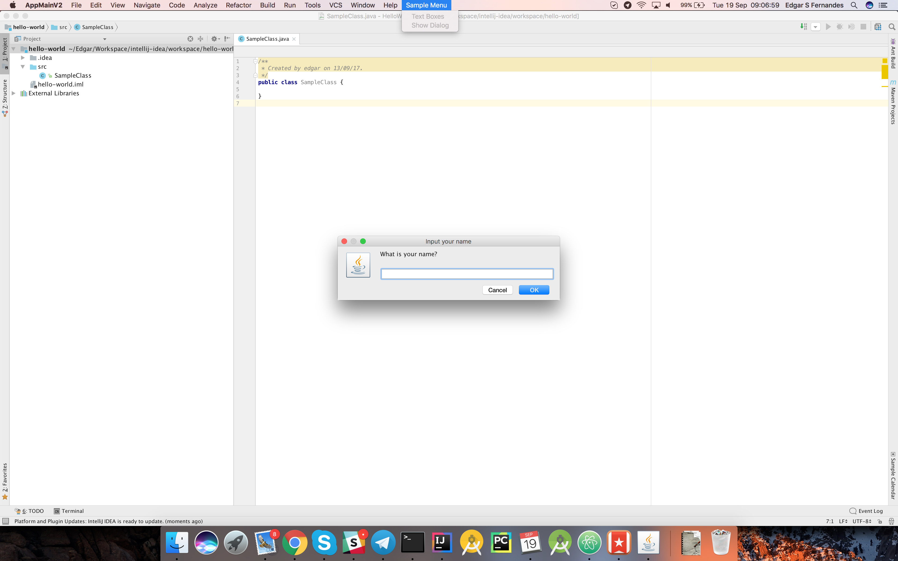

# Sample IntelliJ Plugins

This is a sample plugin that adds an upper menu group on IntelliJ IDEA Community Edition, displaying a dialog box when users selects this **action**.

  
    
  <i><b>Figure 01:</b> Sample UI plugin for IntelliJ IDEA Community Edition</i>

